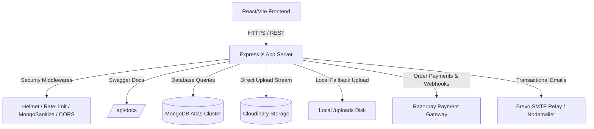
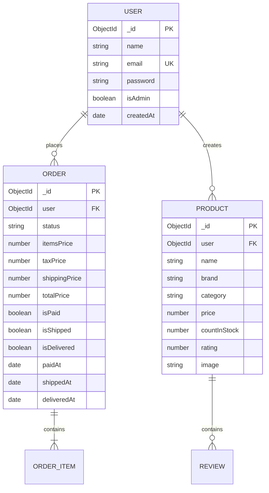
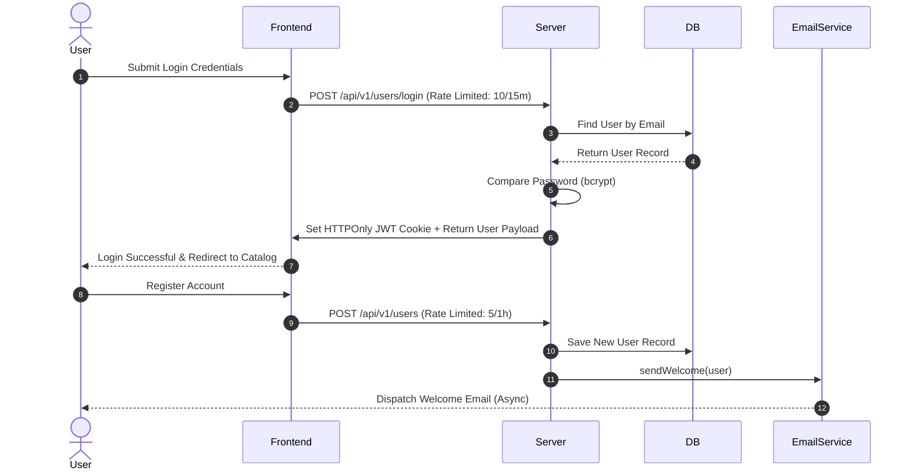
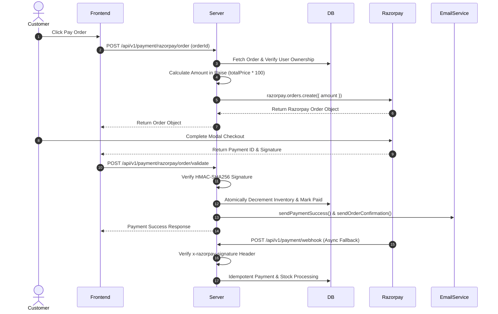
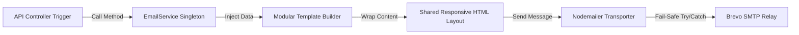

# MERN E-Commerce Platform (Production Ready)

[](https.github.com/ajayboro/MERN-eCommerce/actions)
[](https://opensource.org/licenses/MIT)
[](https://nodejs.org/)
[](http://localhost:5000/api/docs)

A production-ready, interview-grade E-Commerce platform built with the MERN stack (MongoDB, Express, React, Node.js). Designed following principal software engineering principles, featuring strict security hardening, server-side payment integrity, automated email workflows, Cloudinary asset storage with local fallback, Pino structured logging, Docker multi-stage containers, and interactive Swagger API documentation.

---

## 📐 System Architecture & Diagrams

### 1. Architecture Diagram


### 2. Entity-Relationship (ER) Diagram


### 3. Authentication Flow


### 4. Payment Integrity & Webhook Flow


### 5. Email Service Architecture Flow


### 6. Deployment Topology
```mermaid
graph TD
    subgraph Vercel CDN
        FE[React SPA Client (Vite)]
    end

    subgraph Render / Railway Server
        BE[Node.js Express App Container]
    end

    subgraph Database
        DB[(MongoDB Atlas DB)]
    end

    subgraph Media & Payment Providers
        Cloudinary[(Cloudinary Asset Cloud)]
        RazorpayGateway[Razorpay Gateway]
    end

    FE -->|API Calls| BE
    BE -->|Connection String| DB
    BE -->|Direct Upload Stream| Cloudinary
    BE -->|Payment Validation| RazorpayGateway
```

---

## ✨ Features

- **Security Hardening**: Global Helmet HTTP headers, `express-mongo-sanitize`, strict CORS policies, and route-specific rate limiting (`express-rate-limit`).
- **Payment Integrity**: 100% server-calculated order pricing, atomic inventory deduction (`countInStock`), and HMAC-SHA256 Razorpay webhook verification.
- **Image Storage Flexibility**: Direct Cloudinary stream uploads with seamless fallback to local disk storage when Cloudinary credentials are absent.
- **Modular Email Engine**: Fail-safe `EmailService` utilizing shared HTML layout and modular templates (`Welcome`, `PasswordReset`, `OrderConfirmation`, `PaymentSuccess`, `PaymentFailed`, `OrderShipped`, `OrderDelivered`).
- **Pino Structured Logging**: Environment-aware, production-safe logging with sensitive credential redaction.
- **Interactive Swagger Documentation**: Exposed at `/api/docs` with OpenAPI 3.0 specifications.
- **Performance Optimization**: `React.lazy()` route code splitting, response compression, and compound database indexing.
- **Containerization**: Multi-stage Docker builds and `docker-compose` setup.

---

## 🛠️ Tech Stack

- **Frontend**: React 18, Vite, Redux Toolkit, React Router v6, React Bootstrap, React Icons.
- **Backend**: Node.js, Express.js, Mongoose, Nodemailer, Razorpay SDK, Cloudinary SDK, Pino, Envalid, Helmet.
- **Database**: MongoDB Atlas.
- **Containerization & CI**: Docker, Docker Compose, Nginx, GitHub Actions.

---

## 📁 Repository Structure

```
MERN-eCommerce/
├── backend/
│   ├── config/          # DB connection, Envalid, Swagger
│   ├── controllers/     # Controller handlers (User, Product, Order, Payment)
│   ├── middleware/      # Auth, Admin, Validator, Error middlewares
│   ├── models/          # Mongoose Schemas (User, Product, Order)
│   ├── routes/          # Express Routers
│   ├── services/email/  # EmailService & HTML templates
│   ├── tests/           # Automated Jest & Supertest test suite
│   ├── utils/           # Logger, Constants, Response Helpers
│   ├── app.js           # Express App configuration
│   ├── Dockerfile       # Multi-stage Backend Dockerfile
│   └── server.js        # Entry point server listener
├── frontend/
│   ├── src/
│   │   ├── pages/       # Lazy-loaded page components
│   │   ├── routes/      # React Router setup with Suspense
│   │   ├── slices/      # Redux Toolkit API slices
│   │   └── main.jsx     # App entrypoint
│   ├── Dockerfile       # Multi-stage Frontend Dockerfile (Nginx)
│   └── nginx.conf       # Nginx SPA configuration
├── .github/workflows/   # GitHub Actions CI pipeline
├── docker-compose.yml   # Multi-container orchestrator
├── package.json         # Root dependency management
└── README.md            # Comprehensive Documentation
```

---

## ⚙️ Environment Variables

Create a `.env` file in the root directory:

```env
# Server Configuration
NODE_ENV=development
PORT=5000
CLIENT_URL=http://localhost:3000

# Security
JWT_SECRET=your_super_secret_jwt_key_here

# Database
MONGO_URI=mongodb+srv://<username>:<password>@cluster.mongodb.net/mern-ecommerce

# Razorpay Payment Gateway
RAZORPAY_KEY_ID=rzp_test_xxxxxx
RAZORPAY_KEY_SECRET=xxxxxx
RAZORPAY_WEBHOOK_SECRET=xxxxxx

# Cloudinary (Optional - Fallback to local storage if omitted)
CLOUDINARY_CLOUD_NAME=your_cloud_name
CLOUDINARY_API_KEY=your_api_key
CLOUDINARY_API_SECRET=your_api_secret

# Email Service (Brevo / Nodemailer)
EMAIL_HOST=smtp-relay.brevo.com
EMAIL_PORT=587
EMAIL_USER=your_smtp_user
EMAIL_PASS=your_smtp_password
EMAIL_FROM=noreply@mernecommerce.com
APP_NAME="MERN Shop"
```

---

## 🚀 Local Development Setup

1. **Clone repository**:
   ```bash
   git clone https://github.com/ajayboro/MERN-eCommerce.git
   cd MERN-eCommerce
   ```

2. **Install dependencies**:
   ```bash
   npm install
   cd frontend && npm install && cd ..
   ```

3. **Run local dev server**:
   ```bash
   npm run dev
   ```

4. **Access Applications**:
   - Web App: `http://localhost:3000` or `http://localhost:5173`
   - API Server: `http://localhost:5000`
   - Swagger API Documentation: `http://localhost:5000/api/docs`
   - System Health: `http://localhost:5000/api/health`

---

## 🐳 Docker Deployment

Run the entire application stack in isolated containers:

```bash
docker-compose up --build
```

---

## 🧪 Running Automated Tests

```bash
npm test
```

---

## 📜 API Documentation & References

Interactive OpenAPI 3.0 documentation is auto-generated and served at [/api/docs](http://localhost:5000/api/docs).

| HTTP Method | Endpoint | Description | Access |
|---|---|---|---|
| `GET` | `/api/health` | System health check & uptime | Public |
| `POST` | `/api/v1/users/login` | User authentication & JWT cookie issuance | Public (Rate limited) |
| `POST` | `/api/v1/users` | User registration & Welcome email | Public (Rate limited) |
| `GET` | `/api/v1/products` | Paginated product list & search | Public |
| `POST` | `/api/v1/orders` | Create order with price & stock verification | Private |
| `POST` | `/api/v1/payment/razorpay/order` | Initiate Razorpay order | Private |
| `POST` | `/api/v1/payment/razorpay/order/validate` | Verify payment signature & decrement stock | Private |
| `POST` | `/api/v1/payment/webhook` | Asynchronous Razorpay webhook handler | Public |
| `POST` | `/api/v1/upload` | Upload image (Cloudinary / Local) | Private/Admin |

---

## 📄 License

This project is licensed under the [MIT License](LICENSE).
